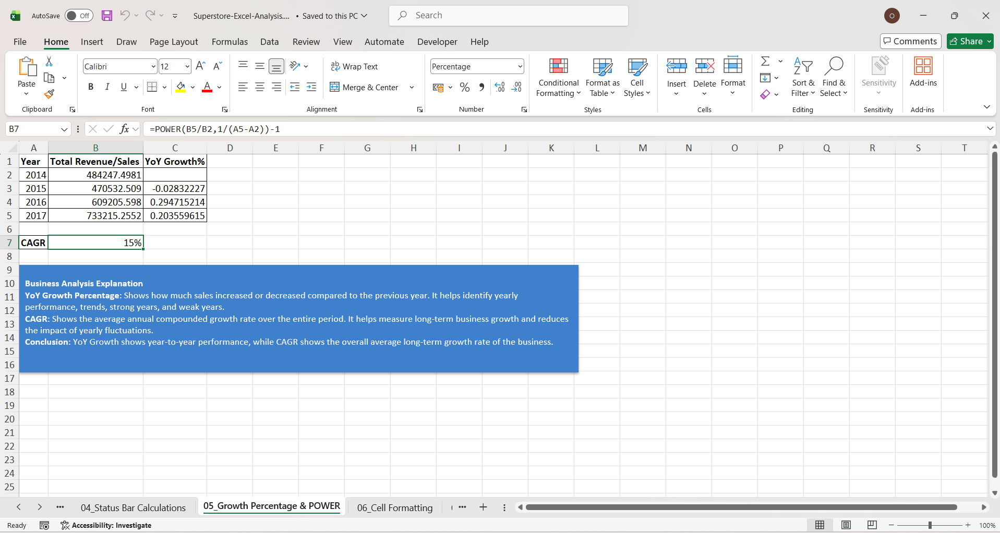
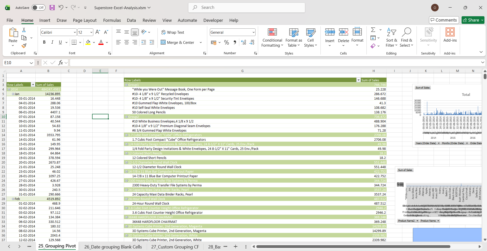
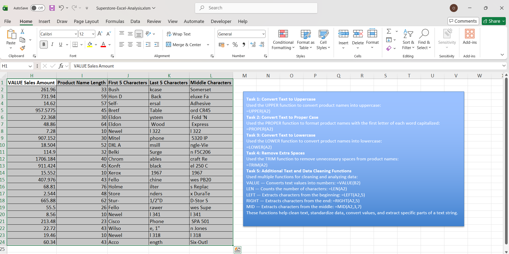

# Superstore Excel Data Analysis & Reporting

## 📌 Project Overview

This project demonstrates practical Excel-based data analysis and reporting using the Sample Superstore dataset.

The workbook covers data preparation, Excel formulas, data cleaning, sorting and filtering, PivotTables, lookup functions, conditional aggregation, report consolidation, conditional formatting, and basic VBA macro automation.

The project was developed to strengthen practical skills in transforming raw business data into structured analysis and reports using Microsoft Excel.

---

## 🎯 Project Objectives

- Analyze sales data using Excel formulas and functions
- Perform data cleaning and transformation
- Calculate business metrics and growth percentages
- Build PivotTable-based analysis
- Use lookup and conditional aggregation functions
- Consolidate data across multiple worksheets
- Apply professional formatting and conditional formatting
- Understand and implement basic VBA macro automation
- Practice structured Excel-based reporting workflows

---

## 📊 Dataset

**Dataset:** Sample Superstore

The dataset contains transactional sales information including fields such as:

- Row ID
- Order ID
- Order Date
- Ship Date
- Ship Mode
- Customer ID
- Customer Name
- Segment
- Country
- City
- Product information
- Sales
- Quantity
- Discount
- Profit

---

## 🛠️ Tools & Technologies

- Microsoft Excel
- Advanced Excel Functions
- PivotTables
- Data Cleaning
- Data Formatting
- Conditional Formatting
- VLOOKUP
- HLOOKUP
- COUNTIF / COUNTIFS
- SUMIF / SUMIFS
- AVERAGEIF
- IF / AND / OR / IFERROR
- Text Functions
- Date Functions
- Data Consolidation
- SUBTOTAL
- VBA Macros

---

## 🔍 Key Analysis Areas

### 1. Excel Formulas

The project includes practical implementation of:

- SUM
- MAX
- MIN
- SMALL
- LARGE
- MEDIAN
- COUNT
- COUNTA
- COUNTBLANK
- IF
- AND
- OR
- IFERROR
- COUNTIF
- COUNTIFS
- SUMIF
- SUMIFS
- AVERAGEIF

---

### 2. Data Cleaning

The workbook demonstrates several data-cleaning techniques, including:

- Removing duplicate values
- Handling error values
- Text standardization
- UPPER
- LOWER
- PROPER
- TRIM
- VALUE
- LEN
- LEFT
- RIGHT
- MID
- SEARCH
- FIND
- Text to Columns
- Find & Replace
- Go To Special

---

### 3. Date Analysis

Date-related analysis includes:

- Date calculations
- Date duration calculations
- DATEDIF
- TODAY
- DATE
- YEAR
- MONTH
- DAY

---

### 4. PivotTable Analysis

The project includes PivotTable exercises covering:

- Creating PivotTables
- Filtering data
- Grouping data
- Date grouping
- Multiple PivotTable analyses
- Custom grouping
- Conditional formatting in PivotTables

---

### 5. Lookup Analysis

Lookup techniques demonstrated include:

- VLOOKUP
- Approximate vs. exact match
- HLOOKUP
- VLOOKUP with IFERROR
- Comparison of VLOOKUP and HLOOKUP

---

### 6. Conditional Aggregation

The project demonstrates:

- COUNTIF
- COUNTIFS
- SUMIF
- SUMIFS
- AVERAGEIF

These functions are used to perform analysis based on one or multiple business conditions.

---

### 7. Report Consolidation

The workbook includes Excel consolidation techniques for combining information from multiple worksheets using:

- SUM
- Consolidate
- Regional data consolidation
- Multiple worksheet reporting
- SUBTOTAL

---

### 8. VBA & Macros

The project also includes introductory VBA work covering:

- Understanding VBA Macros
- Enabling the Developer tab
- Creating and running macros
- Running macros using different methods
- Understanding the VBA workspace
- Working with VBA code

---

## 📸 Project Screenshots

### Sales Analysis



### PivotTable Analysis



### Data Cleaning



### VBA Automation


---

## 📁 Repository Structure

```text
superstore-excel-data-analysis/
│
├── README.md
│
├── Superstore-Excel-Analysis.xlsm
│
└── screenshots/
    ├── sales-analysis.png
    ├── pivot-table.png
    ├── data-cleaning.png
    └── vba-macro.png
